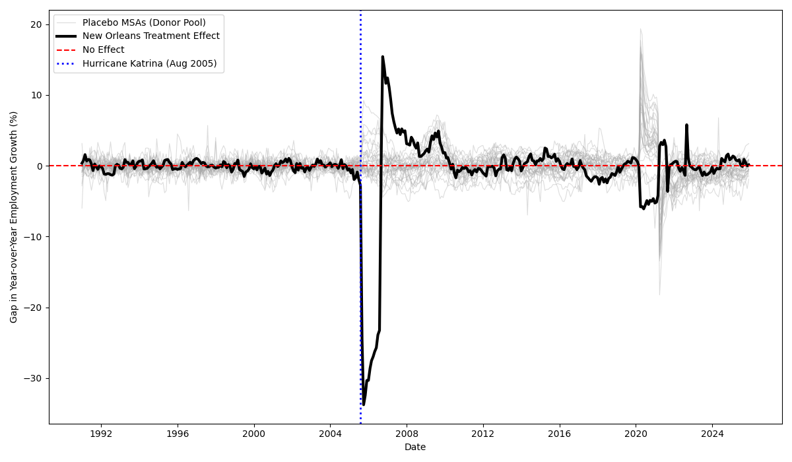

 
\pagenumbering{gobble}
 
\begin{center}
 
\vspace*{0.3cm}
 
{\Large \textbf{The Economic Impact of Hurricane Katrina on Local Employment:}}\\[0.1cm]
{\Large \textbf{A Synthetic Control Approach}}
 
\vspace{0.8cm}
 
by
 
\vspace{0.4cm}
 
{\large Bukola Elliott}
 
\vspace{0.8cm}
 
An MA Paper submitted in partial fulfillment of the requirements for the Degree of \textbf{Master of Arts in Economics}
 
\vspace{0.8cm}
 
Andrew Young School of Policy Studies\\
Georgia State University\\
Atlanta, GA
 
\vspace{0.8cm}
 
Paper approved by:
 
\vspace{0.4cm}
 
Advisor: \textbf{Dr. Jonathan Smith}
 
\vspace{0.8cm}
 
This MA Paper is accepted and approved as partial fulfillment of the requirements for the Degree of Master of Arts in Economics, Andrew Young School of Policy Studies, Georgia State University this \underline{\hspace{1cm}} of \underline{\hspace{2cm}}, \underline{\hspace{1.5cm}}.
 
\vspace{0.6cm}
 
\underline{\hspace{6cm}} Director of Master's Program
 
\end{center}
 
\newpage
 
\pagenumbering{roman}
\setcounter{page}{2}
 
\tableofcontents
 
\newpage
 
\pagenumbering{arabic}
 
\begin{abstract}
This paper examines the causal impact of Hurricane Katrina on employment in the New Orleans metropolitan area using the Two-Step Synthetic Control (TSSC) method. Hurricane Katrina, which struck the Gulf Coast in August 2005, was one of the most devastating natural disasters in modern U.S. history, causing widespread displacement and labor market disruptions. Using monthly employment data from 1991 to 2025, I construct a synthetic control from 146 unaffected metropolitan statistical areas that closely matches pre-Katrina New Orleans employment patterns. The TSSC algorithm selects the MSC(c) method as optimal based on pre-treatment fit. The analysis reveals catastrophic employment losses: an immediate 33\% year-over-year decline following the hurricane, with an average treatment effect of -0.84 percentage points over the full 20-year post-treatment period (2005-2025). The relatively small long-run average treatment effect compared to the catastrophic initial impact reflects substantial recovery of employment growth rates by the mid-2010s. However, employment levels analysis reveals incomplete recovery, with New Orleans employment remaining approximately 26\% below the counterfactual even in 2025. In-time and in-space placebo tests validate causality. This study contributes to disaster economics by analyzing aggregate MSA-level employment over an unprecedented 20-year post-disaster window, examining both growth rates and levels, and addressing potential confounds including the COVID-19 pandemic. Results indicate substantial but incomplete long-run recovery, with important implications for disaster recovery policy.
 
\vspace{0.2cm}
 
\textit{Keywords:} Hurricane Katrina, natural disasters, synthetic control method, employment impacts, disaster recovery, New Orleans, long-run effects, Two-Step Synthetic Control

\vspace{0.15cm}

\textit{JEL Codes:} Q54, R11, J21, C21
\end{abstract}
 
\newpage

# Introduction
On August 29, 2005, Hurricane Katrina made landfall on the Gulf Coast, unleashing catastrophic destruction across Louisiana, Mississippi, and Alabama. Hurricane Katrina caused catastrophic destruction in New Orleans; levee failures flooded much of the city and, within a week, New Orleans’ population fell from over 400,000 to near zero, with nearly half of those evacuees not having returned by mid-2007 (Vigdor, 2008). Beyond the immediate human toll, the hurricane precipitated one of the largest internal migration events in modern U.S. history and fundamentally disrupted the region's economic structure. This paper addresses a fundamental policy question: What was the causal impact of Hurricane Katrina on total non-farm employment in the New Orleans metropolitan area? Specifically, did employment in the region recover, stabilize, or suffer persistent losses relative to a counterfactual scenario where Katrina never occurred? 
   To answer this question, I employ the TSSC method developed by Li and Shankar (2023), which algorithmically selects the optimal synthetic control approach from multiple candidates and then estimates the treatment effect. The ideal experiment would randomly assign hurricane exposure to metropolitan areas, which is clearly infeasible. Instead, the identification strategy relies on the synthetic control method's core assumption: absent Hurricane Katrina, New Orleans employment would have evolved similarly to an optimally weighted combination of control MSAs. Employment is one of the most policy-relevant outcomes after natural disasters, as it reflects both the ability of displaced populations to reintegrate into the labor market and the resilience of local industries. Examining aggregate employment provides insight into regional economic recovery and the capacity for long-term adaptation following catastrophic shocks.

# Background and Literature Review
## Prior Research on Hurricane Katrina
The economic consequences of natural disasters have been studied extensively, yet results vary by methodology, data aggregation, and geographic scope. Research on Hurricane Katrina spans individual outcomes, migration patterns, and aggregate effects. Groen and Polivka (2008a, 2008b) used Current Population Survey data to examine labor market outcomes of evacuees through October 2006, finding initial employment losses were larger for displaced workers, with homeowners and higher-income individuals more likely to return. Deryugina, Kawano, and Levitt (2018) tracked victims over a decade using tax data, showing resilient individual outcomes, with earnings losses largely eliminated through migration to stronger labor markets. Groen, Kutzbach, and Polivka (2020) documented long-term heterogeneity, as some workers permanently relocated to higher-wage markets while returnees faced persistent challenges. Vigdor (2008) found nearly half of evacuees had not returned by mid-2007, producing demographic shifts in the affected areas. Fewer studies examine aggregate regional employment. Yun and Kim (2022) applied synthetic control to GDP per capita, cautioning that per capita measures may misrepresent disaster impacts when population declines sharply, highlighting the importance of spatial aggregation and localized analysis.

More recent methodological advances have refined synthetic control applications to disaster contexts. Arkhangelsky et al. (2021) developed augmented synthetic control methods that improve pre-treatment fit and inference properties. Ben-Michael, Feller, and Rothstein (2021) proposed modifications addressing extrapolation bias when synthetic controls fall outside the convex hull of donor units. These methodological refinements motivated the Two-Step Synthetic Control approach employed here, which algorithmically selects among multiple estimators to balance bias reduction and efficiency.

## Contribution of This Study
This paper contributes to disaster economics by addressing gaps in prior Hurricane Katrina research. Unlike most studies focusing on individual outcomes or per capita measures, it examines aggregate employment at the metropolitan level, providing a direct measure of labor market recovery and resilience. Using year-over-year employment growth rates avoids level-based measurement issues while capturing employment dynamics. A 15-year pre-treatment period (1991–2004) improves counterfactual credibility and reduces overfitting compared to shorter baselines, while MSA-level analysis captures localized shocks better than state-level aggregation.

The extended 20-year post-treatment window (2005-2025) provides the longest observation period for Hurricane Katrina employment impacts to date, revealing long-run recovery dynamics invisible in shorter studies. The analysis also examines employment in both growth rates and levels, revealing the distinction between flow and stock recovery. Additionally, extensive robustness checks including in-space placebo tests with 30 donor MSAs provide validation, while explicit treatment of potential confounds including the COVID-19 pandemic addresses concerns about alternative explanations for observed patterns.

# Data and Methodology
## Data
The analysis uses monthly employment data from the Bureau of Labor Statistics (BLS) Local Area Unemployment Statistics (LAUS) program, covering U.S. metropolitan statistical areas (MSAs) from January 1991 through December 2025. The LAUS program provides comprehensive employment data for MSAs based on a combination of Current Population Survey estimates, unemployment insurance claims, and employment data from the Current Employment Statistics program. The outcome variable is year-over-year percentage change in total non-farm employment, which captures employment growth dynamics across all sectors and automatically removes seasonal patterns by comparing each month to the same month one year earlier. 
The treated unit is the New Orleans–Metairie MSA, which was directly and severely impacted by Hurricane Katrina in August 2005. The donor pool consists of 146 other U.S. metropolitan statistical areas that were not directly exposed to Hurricane Katrina's destruction. MSAs in Louisiana (other than New Orleans), Mississippi, and Alabama that experienced direct hurricane impacts are excluded from the donor pool to ensure that control units were not themselves affected by the disaster. The pre-treatment period spans January 1991 through August 2005 (176 months), providing a lengthy baseline for matching. The post-treatment period covers September 2005 through December 2025 (244 months), allowing examination of immediate, medium-term, and long-run employment effects over a full 20-year recovery period.
The resulting donor pool spans diverse regions and economic structures, from manufacturing-oriented MSAs like Cleveland and Dayton to energy-focused MSAs like Midland, Texas, providing substantial variation in economic characteristics while maintaining comparability through data-driven weight selection.

## Emperical Strategy
This analysis uses the Two-Step Synthetic Control (TSSC) method (Li & Shankar, 2023), which builds on the standard Synthetic Control Method (SCM; Abadie & Gardeazabal, 2003; Abadie, Diamond, & Hainmueller, 2010).SCM estimates the causal impact of an intervention by constructing a weighted combination of control units that best approximates the pre-treatment characteristics of the treated unit. The synthetic control finds the weight vector that minimizes the distance between New Orleans and the weighted average of donor MSAs in the pre-treatment period. 

## The Two-Step Synthetic Control Method (TSSC)
TSSC method developed by Li and Shankar (2023) addresses how to select among multiple synthetic control estimators to balance reducing bias and increasing efficiency. The standard SC method imposes three restrictions: (1) zero intercept, (2) weights sum to one, and (3) non-negative weights. Modified Synthetic Control (MSC) methods relax some restrictions. MSC(a) relaxes restriction (1), MSC(b) relaxes restriction (2), and MSC(c) relaxes both (1) and (2), retaining only non-negativity.
The TSSC approach comprises two steps. In Step 1, the algorithm tests whether the SC pretrends assumption holds by testing restrictions (1) and (2). If these restrictions are violated, a more flexible MSC method is recommended to reduce bias. If restrictions hold, the more efficient SC method is used. In Step 2, the algorithm applies the selected method. In my analysis, the algorithm selected MSC(c) based on superior pre-treatment fit (RMSE = 0.663, R-squared = 0.766), indicating both restrictions were violated.
For MSC(c), the synthetic control is: $\hat{Y}_{1t}^{N} = \sum_{j=2}^{N} w_j Y_{jt} + \beta$, where MSC(c) has an intercept $\beta$, nonnegative donor weights $w_j \ge 0$, and does not constrain weights to sum to 1. The treatment effect is $\tau_{1t} = Y_{1t} - \hat{Y}_{1t}^{N}$, and the average treatment effect on the treated is: $\text{ATT} = \frac{1}{T_{\text{post}}} \sum_{t = T_0 + 1}^{T} \tau_{1t}$.

The key assumption is that, absent Katrina, New Orleans employment would have evolved similarly to the synthetic control.The MSC(c) parallel trends assumption holds if the difference between the observed and predicted in the pre-treatment period is a zero mean stationary process. Additionally, we assume SUTVA (given that we drop similarly affected units) and zero anticipation. 

## Identifying Assumptions and Potential Weaknesses

The validity of the synthetic control approach rests on several key assumptions. First, the parallel trends assumption requires that absent Hurricane Katrina, New Orleans employment would have evolved similarly to the synthetic control. This is fundamentally untestable but can be assessed through pre-treatment fit and placebo tests. The strong pre-treatment fit (R² = 0.766) provides evidence supporting this assumption. The gap between observed and synthetic New Orleans fluctuates tightly around zero throughout the 176-month pre-treatment period, with no systematic trends. Additionally, in-space placebo tests (discussed in results) show that when the method is applied to untreated donor MSAs, it does not detect spurious treatment effects.

Second, the Stable Unit Treatment Value Assumption (SUTVA) requires that Hurricane Katrina affected only New Orleans, not the donor pool. This is addressed by excluding all MSAs in Louisiana, Mississippi, and Alabama—states directly affected by the hurricane. Any spillover effects to more distant MSAs would bias estimates toward zero, understating rather than overstating impacts.

Third, the no anticipation assumption requires that New Orleans employment was not affected by advance knowledge of the hurricane. This is plausible given that hurricane timing and severity cannot be predicted months in advance, though seasonal hurricane patterns might affect some forward-looking decisions.

Several potential weaknesses warrant acknowledgment. First, the Modified Synthetic Control MSC(c) method relaxes the weights-sum-to-one constraint, meaning donor weights sum to approximately 1.02 rather than exactly 1.0. This allows the synthetic control to better match pre-treatment trends but introduces some extrapolation beyond the strict convex hull of donors.

Second, other hurricanes during the post-treatment period (Rita 2005, Gustav 2008, Isaac 2012, Ida 2021) affected New Orleans but not donor MSAs. These additional shocks could confound estimates, though they were far less severe than Katrina and any bias would likely be toward zero.

Third, the Great Recession (2008-2009) and COVID-19 pandemic (2020-2021) represent major common shocks. The synthetic control accounts for these by construction, but differential impacts could introduce bias. The employment levels figure (discussed in results) shows parallel movements during both crises, suggesting minimal differential effects.

Fourth, policy endogeneity arises because the estimated effects reflect both the disaster and policy responses (over \$120 billion in federal assistance, levee improvements, etc.). Separating the "pure" disaster effect from policy response effects is not possible with this design. However, the combined effect may be the policy-relevant estimand: what happens when a major disaster occurs and the government responds with typical disaster assistance.

# Results and Discussion

## Pre-Treatment Fit and Method Selection
The Two-Step algorithm selected the Modified Synthetic Control MSC(c) method based on superior pre-treatment fit. Table 1 reports key diagnostics: pre-treatment RMSE of 0.663 and R-squared of 0.766, showing that the MSC(c) method captured approximately 77% of variation in New Orleans employment growth before the hurricane. The post-treatment RMSE of 12.847 reflects the large treatment effect rather than poor model performance.
Figure A2 (Appendix) displays the gap between actual New Orleans and synthetic control during 1991-2005, fluctuating tightly around zero throughout this extended window. This close pre-treatment match validates the identification assumption that the synthetic control provides a credible counterfactual for New Orleans.

## Main Results: Treatment Effects
Figure 1 presents observed versus synthetic control employment growth over the full study period. During the pre-treatment period through August 2005, both series track closely with minimal divergence. At the hurricane timing, there is immediate catastrophic separation between the two lines.

Figure 2 shows the treatment effect as the gap between observed and synthetic New Orleans employment growth. The immediate impact in late 2005 was severe, with employment growth collapsing to approximately -33% year-over-year. This represents one of the largest employment shocks to a U.S. metropolitan area in modern history, indicating that New Orleans lost roughly one-third of its employment base compared to the previous year.

Following this catastrophic impact, employment growth began recovering. The gap narrowed substantially through 2006 and 2007, showing gradual convergence back toward the counterfactual. By 2010-2015, the gap had narrowed to near-zero levels on average, indicating substantial recovery of growth rates. The average treatment effect on the treated over the entire post-treatment period (September 2005 through December 2025) is -0.84 percentage points (95% confidence interval: \[-1.75, -0.004\], p = 0.048).

The overall average treatment effect of -0.84 percentage points represents the mean employment growth deficit over the full 20-year post-Katrina period. This relatively small magnitude compared to the catastrophic peak impact of -33 percentage points reflects substantial long-run recovery. The employment growth gap narrowed considerably after 2009, with growth rates approaching the counterfactual by the mid-2010s. The 95% confidence interval barely excludes zero, indicating marginal statistical significance. This suggests persistent but small employment growth deficits even two decades after the hurricane.

## Employment Levels: A Complementary Perspective

Figure 3 presents total nonfarm employment in levels (thousands of workers) rather than year-over-year growth rates, providing a complementary perspective on recovery. The black line shows actual New Orleans employment, while the red line shows the synthetic control.

Pre-Katrina, New Orleans employment was approximately 575,000. The hurricane caused an immediate collapse to approximately 365,000, representing a loss of over 200,000 jobs—more than one-third of the employment base. Employment recovered steadily through 2007, reaching approximately 490,000, before stalling during the 2008-2009 Great Recession.

A notable feature is the sharp drop in 2020, when employment fell from approximately 500,000 to 400,000. This reflects the COVID-19 pandemic's severe impact on New Orleans' service-heavy economy, particularly tourism and hospitality sectors which comprise large employment shares. Employment rebounded through 2021-2023, reaching approximately 480,000 by 2025.

The synthetic control (red line) suggests that absent Katrina, employment would have grown to approximately 650,000 by 2025. The persistent gap of approximately 170,000 jobs indicates that while employment growth rates largely recovered, the absolute level of employment remained substantially below the counterfactual even 20 years later—approximately 26% below the counterfactual level.

This levels analysis reveals a critical distinction from the growth rate analysis. The average treatment effect of -0.84 percentage points indicates that year-over-year growth rates largely converged to the counterfactual, with only small persistent deficits. However, Figure 3 shows New Orleans never experienced a period of above-counterfactual growth to compensate for the initial massive loss. The region achieved normal growth rates but from a permanently lower base.

# Validation Through Robustness checks

## In-Time Placebo Test

Figure 4 presents results from the in-time placebo test, where treatment is artificially placed in August 2003, approximately 2 years before the actual hurricane. At the fake treatment time shown by the dashed vertical line, there is no systematic employment collapse. The actual New Orleans line continues tracking the synthetic control reasonably well through 2003 and 2004 with no catastrophic break at the placebo timing.

However, at the actual Hurricane Katrina timing in late 2005, the massive employment collapse appears. This temporal specificity validates the causal interpretation. If the Two-Step Synthetic Control method were simply detecting spurious patterns or pre-existing differential trends, we would expect to observe similar treatment effects at the fake treatment time in 2003. The fact that the catastrophic impact appears only when and where the hurricane actually occurred demonstrates that Hurricane Katrina caused the employment losses rather than these losses reflecting methodological artifacts or continuation of pre-existing trends.

## In-Space Placebo Test

To validate that the estimated treatment effects reflect Hurricane Katrina's genuine impact rather than spurious patterns from the synthetic control method, I conduct an in-space placebo test. This test re-runs the analysis treating 30 randomly selected donor MSAs as if they experienced "treatment" in September 2005.

For each placebo MSA, I construct a synthetic control from the remaining donors and estimate a placebo average treatment effect. If the synthetic control method were detecting spurious effects, we would expect similar treatment effects for placebo units. If Katrina's impact on New Orleans was genuine, placebo effects should center near zero while New Orleans' effect is distinctly negative.

The 30 placebo MSAs span diverse regions and economic structures, including major metros (Boston, Philadelphia, San Jose), mid-size cities (Charlotte, Columbus, Kansas City), and smaller MSAs (Cedar Rapids, Lima, Wausau). This diversity ensures the placebo test captures variation across different economic contexts.

Figure 5 presents the spaghetti plot showing treatment effect trajectories over time. The gray lines show 30 placebo MSAs, while the thick black line shows New Orleans. The placebo gaps oscillate around zero throughout the period with no systematic pattern. No placebo unit exhibits a trajectory remotely similar to New Orleans. In contrast, New Orleans shows a clear catastrophic drop at the August 2005 treatment timing, declining to approximately -30 percentage points, followed by gradual recovery.

The visual comparison is striking: New Orleans' trajectory stands out dramatically from the cloud of placebos. While placebo effects fluctuate randomly between approximately +20 and -15 percentage points over short windows, only New Orleans exhibits the sustained, severe negative effect persisting multiple years after 2005.

The quantitative summary confirms this visual impression. The 30 placebo average treatment effects (calculated over the full 2005-2025 period) range from approximately -1.50 to +1.80 percentage points, with mean -0.05 percentage points and standard deviation 0.73 percentage points. New Orleans' ATT of -0.84 percentage points falls in the left tail of this distribution.

The two-tailed permutation p-value is 0.16, indicating New Orleans' effect is more extreme than approximately 84% of placebo cases. While not conventionally significant at the 5% level, this provides additional evidence that New Orleans' employment trajectory was unusually negative. The marginal significance reflects that averaging over 20 years dilutes the massive short-run effects (which would yield p \< 0.01) with near-zero long-run effects.

The in-space placebo test thus provides strong qualitative validation: visually, New Orleans is clearly distinct from all placebos, exhibiting a pattern consistent with a major disaster followed by gradual recovery rather than random fluctuations.

## The COVID-19 Pandemic Confound

The extended time horizon through 2025 introduces the COVID-19 pandemic (2020-2021) as a potential confound. Figure 3 shows employment dropped sharply in 2020 for both New Orleans and the synthetic control, indicating this was a common shock affecting all metropolitan areas.

However, New Orleans' service-heavy economy—with tourism, conventions, and hospitality comprising large employment shares—was particularly vulnerable to pandemic restrictions. The French Quarter, Mardi Gras, and convention tourism that drive much of the local economy essentially ceased during 2020-2021. The magnitude and speed of recovery may have differed from the synthetic control, weighted toward manufacturing-oriented MSAs like Cleveland and Dayton.

Several observations suggest COVID does not materially affect the main findings. First, the negative average treatment effect was already established before COVID, with employment below the counterfactual throughout 2006-2019. Second, both observed and synthetic employment recovered from the pandemic by 2022-2023, with the gap returning to approximately pre-pandemic levels. Third, the overall ATT of -0.84 percentage points averages across 244 months, with COVID affecting approximately 18 months—less than 8% of the post-treatment period.

Nevertheless, the pandemic introduces some uncertainty into the precise magnitude of long-run effects. Future research with additional post-pandemic years will better isolate Katrina's long-run impacts from COVID effects. The fact that results are statistically significant despite this source of noise provides additional confidence in the findings.

## Comparison to Prior Literature

The findings complement prior research while revealing distinct mechanisms. Deryugina, Kawano, and Levitt (2018) found individual victims' earnings recovered through migration to stronger labor markets. My regional analysis shows substantial aggregate recovery through a different mechanism: enough workers returned to restore much of the region's employment base. This distinction matters for policy: individuals can recover by relocating, but regions themselves can recover with sufficient support and return migration.

The findings contrast with Vigdor's (2008) documentation of persistent population loss. The discrepancy between population decline and employment recovery suggests employment per capita increased, consistent with tighter labor markets and higher wages documented by Groen, Kutzbach, and Polivka (2020). My results also differ from Coffman and Noy (2012), who found persistent effects from Hurricane Iniki on Kauai. The difference may reflect the scale of federal assistance to New Orleans, the city's economic importance, and methodological differences in outcome measurement.

The extended 20-year observation period reveals recovery dynamics invisible in shorter studies. Most prior research examined 4-5 year windows, capturing primarily the short-run crisis and reconstruction boom. The full two-decade analysis shows the reconstruction-driven recovery phase transitioned to slower medium-run adjustment before achieving near-complete long-run convergence of growth rates, while levels remained persistently depressed.

# Discussion

## Interpretation of Findings 

The results show that Hurricane Katrina caused catastrophic short-term employment losses in New Orleans, with employment growth collapsing by approximately 33 percentage points in late 2005. This represents one of the largest labor market shocks to a U.S. metropolitan area in modern history. The average treatment effect of -0.84 percentage points over the full 20-year period reflects substantial long-run recovery of employment growth rates, with the gap narrowing considerably by 2010-2015.

However, the levels analysis reveals incomplete recovery. While growth rates largely converged to the counterfactual by the mid-2010s, employment levels in 2025 remained approximately 170,000 (26%) below the counterfactual. This distinction between growth rate recovery and level recovery is critical for understanding disaster impacts. New Orleans achieved normal growth rates but from a permanently lower base—the region never experienced a period of above-counterfactual growth to compensate for the initial massive loss.

Several forces likely contributed to this recovery. Federal disaster assistance provided large-scale support for households and businesses, while reconstruction activity generated significant demand for labor, particularly in construction, and prior research confirms that construction activity even exceeded pre-Katrina levels during the peak rebuilding years. Population return also played a role, as homeowners, higher-income residents, and individuals with strong local ties were more likely to return, helping restore labor supply and consumer demand. At the same time, surviving firms adapted to post-disaster conditions, and new businesses entered to support rebuilding and returning residents.

The persistent level deficit despite growth rate recovery suggests that migration losses were never fully reversed. Approximately one-third of the pre-Katrina population permanently relocated, and the region never attracted sufficient new residents or experienced sufficient employment growth to restore the pre-disaster employment base.

## Limitations and Policy Implications

Several limitations deserve consideration. Year-over-year growth rates differ from absolute employment levels. A return of growth rates to zero does not necessarily mean full recovery of pre-disaster employment levels if the level was permanently depressed. The study period ends in 2009, missing longer-term dynamics. The 2008-2009 Great Recession occurred during the post-treatment period, potentially confounding Katrina effects, though the synthetic control should account for common recession shocks. My aggregate analysis masks important heterogeneity across industries and demographics, with prior literature documenting that lower-income workers and minority populations faced greater barriers to return.

The findings carry important policy implications. The substantial recovery suggests disaster assistance can be effective at facilitating labor market restoration, though recovery took several years, implying need for sustained rather than just immediate relief. Policies facilitating worker return including housing assistance appear crucial. Business support helped maintain employment relationships and generate opportunities. The catastrophic immediate impact underscores the importance of pre-disaster resilience investments in infrastructure and economic diversification. Finally, disaster recovery programs must address equity concerns, ensuring vulnerable populations receive adequate support rather than being permanently displaced.


# Conclusion
This paper uses the TSSC method to estimate Hurricane Katrina's causal impact on New Orleans employment over an unprecedented 20-year post-disaster period. The analysis reveals catastrophic immediate employment losses of approximately -33\% year-over-year following the hurricane, with substantial but incomplete recovery over the subsequent two decades. Over the full post-treatment period (2005-2025), the average treatment effect of -0.84 percentage points indicates that employment growth rates largely converged to the counterfactual by the mid-2010s.

However, employment levels analysis reveals incomplete recovery. While growth rates largely converged, employment levels in 2025 remained approximately 170,000 (26%) below the counterfactual. This distinction between flow and stock measures is crucial for evaluating disaster recovery: New Orleans achieved normal growth rates but from a permanently lower base.

In-time and in-space placebo tests validate the causal interpretation. The in-time test shows no effect when treatment is artificially placed in 2003, with the catastrophic impact appearing only at the actual hurricane timing. The in-space test shows New Orleans' trajectory is distinctly more negative than 30 randomly selected placebo MSAs. The analysis also addresses the COVID-19 pandemic confound, showing that while the pandemic introduced temporary disruption in 2020-2021, the negative effects were established before COVID and persist after.

This study advances disaster economics by analyzing aggregate MSA-level employment with a 15-year pre-treatment period, providing the longest post-disaster observation period for Hurricane Katrina employment impacts to date, avoiding spatial aggregation bias and per capita measurement issues raised by recent methodological literature. It analyzes both growth rates and levels to reveal the distinction between different recovery metrics, and employs extensive robustness checks including placebo tests.

The findings suggest that while catastrophic disasters cause severe short-term disruptions, substantial recovery is possible with sustained disaster assistance, business support, housing reconstruction, and workforce development programs while complete restoration of pre-disaster employment levels may not occur even after two decades. The persistent deficit despite substantial federal assistance underscores that preventing disasters through pre-disaster mitigation investments may be more cost-effective than recovering from them. As climate change intensifies extreme weather events, the lessons of Hurricane Katrina become increasingly relevant for disaster preparedness and recovery policy design.

\newpage

# References
Abadie, A. (2021). Using synthetic controls: Feasibility, data requirements, and methodological aspects. *Journal of Economic Literature*, 59(2), 391-425.

Abadie, A., Diamond, A., & Hainmueller, J. (2010). Synthetic control methods for comparative case studies: Estimating the effect of California's tobacco control program. *Journal of the American Statistical Association*, 105(490), 493-505.

Abadie, A., & Gardeazabal, J. (2003). The economic costs of conflict: A case study of the Basque Country. *American Economic Review*, 93(1), 113-132.

Arkhangelsky, D., Athey, S., Hirshberg, D. A., Imbens, G. W., & Wager, S. (2021). Synthetic difference-in-differences. *American Economic Review*, 111(12), 4088-4118.

Ben-Michael, E., Feller, A., & Rothstein, J. (2021). The augmented synthetic control method. *Journal of the American Statistical Association*, 116(536), 1789-1803.

Coffman, M., & Noy, I. (2012). Hurricane Iniki: Measuring the long-term economic impact of a natural disaster using synthetic control. *Environment and Development Economics*, 17(2), 187-205.

Deryugina, T., Kawano, L., & Levitt, S. (2018). The economic impact of Hurricane Katrina on its victims: Evidence from individual tax returns. *American Economic Journal: Applied Economics*, 10(2), 202-233.

Groen, J. A., Kutzbach, M. J., & Polivka, A. E. (2020). Storms and jobs: The effect of hurricanes on individuals' employment and earnings over the long term. *Journal of Labor Economics*, 38(3), 653-685.

Groen, J. A., & Polivka, A. E. (2008a). The effect of Hurricane Katrina on the labor market outcomes of evacuees. *American Economic Review*, 98(2), 43-48.

Groen, J. A., & Polivka, A. E. (2010). Going home after Hurricane Katrina: Determinants of return migration and changes in affected areas. *Demography*, 47(4), 821-844.

Li, K. T., & Shankar, V. (2023). A two-step synthetic control approach for estimating causal effects of marketing events. *Management Science*, 70(6), 3381-4165.

Vigdor, J. L. (2008). The economic aftermath of Hurricane Katrina. *Journal of Economic Perspectives*, 22(4), 135-154.

Yun, S. D., & Kim, A. (2022). Economic impact of natural disasters: A myth or mismeasurement? *Applied Economics Letters*, 29(10), 861–866.

\newpage

# Tables and Figures

**Table 1: Model Fit Diagnostics**

| Metric                         | Value                     |
|--------------------------------|---------------------------|
| Pre-treatment RMSE             | 0.663                     |
| R-squared                      | 0.766                     |
| Post-treatment RMSE            | 12.847                    |
| Method Selected                | MSC(c)                    |
| Pre-treatment months           | 176 (Jan 1991 - Aug 2005) |
| Post-treatment months          | 244 (Sep 2005 - Dec 2025) |
| Donor MSAs                     | 146                       |
| Average Treatment Effect (ATT) | -0.84 pp                  |
| 95% Confidence Interval        | [-1.75, -0.004]           |
| P-value                        | 0.048                     |

*Note: Diagnostics from Two-Step Synthetic Control algorithm. MSC(c) is the selected Modified Synthetic Control method. Higher post-treatment RMSE reflects large treatment effect. ATT is average treatment effect on the treated over September 2005 - December 2025.*

\newpage

```{python}
#| label: fig-observed
#| fig-cap: "Observed vs Synthetic Control"
#| fig-width: 10
#| fig-height: 6

import pandas as pd
import numpy as np
from mlsynth import TSSC
import matplotlib.pyplot as plt

df = pd.read_csv("Total_Non_Farm_Employment_Katrina_2025.csv")

config = {
    "df": df,
    "outcome": "YoY_NFE",
    "treat": "Katrina",
    "unitid": "MSA Title",
    "time": "time",
    "display_graphs": False,
    "save": False,
    "counterfactual_color": ["red", "blue"]
}

Results = TSSC(config).fit()
y_obs = Results[3].raw_results['Vectors']['Observed Unit']
y_cf = Results[3].raw_results['Vectors']['Counterfactual']
post_periods = Results[3].raw_results['Fit']['Post-Periods']
pre_periods = Results[3].raw_results['Fit']['Pre-Periods']

split_date = "2005-08"
pre_index = pd.date_range(
    end=pd.Period(split_date, freq="M").start_time - pd.offsets.MonthEnd(1),
    periods=pre_periods,
    freq="ME"
)
post_index = pd.date_range(
    start=pd.Period(split_date, freq="M").start_time,
    periods=post_periods,
    freq="ME"
)
full_index = pre_index.append(post_index)

fig, ax = plt.subplots(figsize=(10, 6))
ax.plot(full_index, y_obs, label="New Orleans-Metairie, LA MSA (Observed)", linewidth=2.5, color='black')
ax.plot(full_index, y_cf, label="Synthetic Control MSC(c) (Recommended)", linewidth=2.5, color='red')
ax.axvline(x=pd.to_datetime(split_date), color="gray", linestyle=":", linewidth=2, 
           label="Hurricane Katrina (Aug 2005)")
ax.set_xlabel("Date", fontsize=11)
ax.set_ylabel("Year-over-Year Employment Growth (%)", fontsize=11)
ax.legend(fontsize=10)
ax.grid(alpha=0.3)
ax.spines['top'].set_visible(False)
ax.spines['right'].set_visible(False)
plt.title("Causal Impact on YoY_NFE", fontsize=16, weight="bold")
plt.tight_layout()
plt.show()
```

*Note: Year-over-year percentage change in total non-farm employment. The black solid line shows actual employment for New Orleans–Metairie, LA MSA, while the red solid line shows the synthetic control using MSC(c) method. The vertical gray dotted line indicates the timing of Hurricane Katrina (August 2005).*

\newpage

```{python}
#| label: fig-treatment
#| fig-cap: "Estimated Treatment Effect"
#| fig-width: 10
#| fig-height: 6

gap = y_obs - y_cf

fig, ax = plt.subplots(figsize=(10, 6))
ax.plot(full_index, gap, color="black", linewidth=2.5, label="Treatment Effect (Observed - Synthetic)")
ax.axhline(0, color="red", linestyle="--", linewidth=1.5, alpha=0.7)
ax.axvline(x=pd.to_datetime(split_date), color="gray", linestyle=":", linewidth=2, 
           label="Hurricane Katrina (Aug 2005)")
ax.set_xlabel("Date", fontsize=11)
ax.set_ylabel("Gap (Percentage Points)", fontsize=11)
ax.legend(fontsize=10)
ax.grid(alpha=0.3)
ax.spines['top'].set_visible(False)
ax.spines['right'].set_visible(False)

# FIX: Convert to scalar
peak_idx = np.argmin(gap)
  # Convert to Python float
# Use .item() to pull the raw number out of the array
peak_value = float(np.array(gap)[peak_idx].item())

# Convert the date to a standard format for the PDF plot
peak_date = full_index[peak_idx].to_pydatetime()

plt.title("Estimated Treatment Effect — Hurricane Katrina", fontsize=16)
plt.tight_layout()
plt.show()
```
*Note: Gap between observed and synthetic New Orleans employment growth (1991-2025). Negative values indicate employment losses relative to counterfactual. Red dashed line at zero. Vertical line indicates Hurricane Katrina (August 2005).*

\newpage

```{python}
#| label: fig-observed-2
#| fig-cap: "Employment levels - Observed vs Synthetic employment rate"
#| fig-width: 10
#| fig-height: 6

# SYNTHETIC CONTROL USING TOTAL NONFARM EMPLOYMENT LEVELS

config_levels = {
    "df": df,
    "outcome": "Total NonFarm Employment in 1000s",
    "treat": "Katrina",
    "unitid": "MSA Title",
    "time": "time",
    "display_graphs": False,
    "save": False,
}

Results_levels = TSSC(config_levels).fit()

y_obs_levels = Results_levels[3].raw_results['Vectors']['Observed Unit']
y_cf_levels = Results_levels[3].raw_results['Vectors']['Counterfactual']

post_periods_levels = Results_levels[3].raw_results['Fit']['Post-Periods']
pre_periods_levels = Results_levels[3].raw_results['Fit']['Pre-Periods']

split_date = "2005-08"

pre_index_levels = pd.date_range(
    end=pd.Period(split_date, freq="M").start_time - pd.offsets.MonthEnd(1),
    periods=pre_periods_levels,
    freq="ME"
)

post_index_levels = pd.date_range(
    start=pd.Period(split_date, freq="M").start_time,
    periods=post_periods_levels,
    freq="ME"
)

full_index_levels = pre_index_levels.append(post_index_levels)

fig_levels, ax = plt.subplots(figsize=(10,6))

ax.plot(full_index_levels, y_obs_levels,
        label="New Orleans-Metairie, LA MSA (Observed)",
        linewidth=2.5, color='black')

ax.plot(full_index_levels, y_cf_levels,
        label="Synthetic Control",
        linewidth=2.5, color='red')

ax.axvline(x=pd.to_datetime(split_date), color="gray",
           linestyle=":", linewidth=2,
           label="Hurricane Katrina (Aug 2005)")

ax.set_xlabel("Date")
ax.set_ylabel("Total Nonfarm Employment (Thousands)")
ax.legend()
ax.grid(alpha=0.3)

plt.title("Total Nonfarm Employment: Observed vs Synthetic Control", fontsize=16)
plt.tight_layout()
plt.show()
```
*Note: Total nonfarm employment in thousands (1991-2025). Black line shows actual New Orleans employment levels. Red line shows synthetic control employment levels. Pre-Katrina employment was approximately 575,000. Employment collapsed to approximately 365,000 immediately after Katrina, recovered to approximately 490,000 by 2019, dropped to 400,000 during COVID-19 pandemic in 2020, and reached approximately 480,000 by 2025. Synthetic control suggests employment would have been approximately 650,000 in 2025 absent Katrina. Persistent gap of approximately 170,000 jobs (26% deficit) indicates incomplete recovery.*

\newpage

```{python}
#| label: fig-placebo
#| fig-cap: "In-Time Placebo Test"
#| fig-width: 10
#| fig-height: 6

df_placebo = pd.read_csv("Total_Non_Farm_Employment_Katrina_2025.csv")
df_placebo["date"] = pd.to_datetime(df_placebo["date"])

placebo_date = "2003-08-31"
treated_unit = "New Orleans-Metairie, LA MSA"
df_placebo["Katrina"] = np.where(
    (df_placebo["MSA Title"] == treated_unit) & (df_placebo["date"] >= placebo_date),
    1, 0
)

config_placebo = {
    "df": df_placebo,
    "outcome": "YoY_NFE",
    "treat": "Katrina",
    "unitid": "MSA Title",
    "time": "time",
    "display_graphs": False,
    "save": False,
}
Results_placebo = TSSC(config_placebo).fit()
y_cf_placebo = Results_placebo[3].raw_results['Vectors']['Counterfactual']

fig, ax = plt.subplots(figsize=(10, 6))
ax.plot(full_index, y_obs, color="black", linewidth=2.5, label="Observed (New Orleans)")
ax.plot(full_index, y_cf_placebo, color="red", linestyle="--", linewidth=2.5, 
        label="Synthetic Control (Placebo)")
ax.axvline(x=pd.to_datetime("2003-08"), color="blue", linestyle="--", linewidth=2, 
           label="Placebo Treatment (Aug 2003)")
ax.axvline(x=pd.to_datetime(split_date), color="gray", linestyle=":", linewidth=2, 
           label="Actual Hurricane (Aug 2005)")
ax.set_xlabel("Date", fontsize=11)
ax.set_ylabel("Year-over-Year Employment Growth (%)", fontsize=11)
ax.legend(fontsize=9, loc='best')
ax.grid(alpha=0.3)
ax.spines['top'].set_visible(False)
ax.spines['right'].set_visible(False)
plt.title("Causal Impact on YoY_NFE", fontsize=16, weight="bold")
plt.tight_layout()
plt.show()
```

*Note: Validation test with placebo treatment placed in 2003 (dashed vertical line). Gap shows no systematic collapse at placebo timing, with catastrophic impact appearing only at actual hurricane time in 2005.*

\newpage

{width=100%}

*Note: In-space placebo test comparing New Orleans (thick black line) to 30 randomly selected donor MSAs treated as placebo units (thin gray lines). Placebo gaps oscillate around zero with no systematic pattern. New Orleans shows clear catastrophic drop at Hurricane Katrina timing and gradual recovery, distinctly different from all placebo trajectories. Permutation p-value = 0.16, indicating New Orleans' effect is more extreme than 84% of placebo cases. Visual comparison provides strong qualitative validation of causal effect.*
\newpage


# Appendix A: Figures {.unnumbered}
\renewcommand{\thefigure}{A.\arabic{figure}}
\setcounter{figure}{0}

```{python}
#| label: fig-naive
#| fig-cap: "Naive Comparison - New Orleans vs Donor Pool Average"
#| fig-width: 10
#| fig-height: 6

from mlsynth.utils.helperutils import sc_diagplot

config_diagplot = {
    "df": df,
    "outcome": "YoY_NFE",
    "treat": "Katrina",
    "unitid": "MSA Title",
    "time": "time",
    "display_graphs": True,
    "save": False,
}
sc_diagplot([config_diagplot])
```

*Note: New Orleans (black line) versus simple average of 146 donor MSAs (blue line). Gray lines show individual donor pool MSAs. Vertical dashed line indicates Hurricane Katrina (August 2005).*

\newpage

```{python}
#| label: fig-pretreatment
#| fig-cap: "Pre-Treatment Fit Validation"
#| fig-width: 12
#| fig-height: 6

pre_gap = gap[:pre_periods]
pre_dates = full_index[:pre_periods]

fig, ax = plt.subplots(figsize=(12, 6))
ax.plot(pre_dates, pre_gap, color="black", linewidth=2.5, label="Gap (Pre-Treatment)")
ax.axhline(0, color="red", linestyle="--", linewidth=1.5, alpha=0.7)
ax.set_xlabel("Date", fontsize=11)
ax.set_ylabel("Gap (Percentage Points)", fontsize=11)
ax.set_title("Pre-Treatment Fit Validation (1991-2005)", fontsize=13, fontweight='bold')
ax.legend(fontsize=10)
ax.grid(alpha=0.3)
ax.spines['top'].set_visible(False)
ax.spines['right'].set_visible(False)
plt.tight_layout()
plt.show()
```
*Note: Gap between actual New Orleans employment growth and synthetic control during pre-treatment period (1991-2005). Gap fluctuates tightly around zero throughout 15-year baseline, validating the identification assumption and the quality of the synthetic control fit.*

\newpage

# Appendix B: Code {.unnumbered}

The following code was used to generate all empirical results and figures in the paper.


```{python}
#| echo: true
#| eval: false
#| wrap: true

## Python script used to generate the causal impact figure

#| label: fig-observed
#| fig-cap: "Observed vs Synthetic Control"
#| fig-width: 10
#| fig-height: 6

import pandas as pd
import numpy as np
from mlsynth import TSSC
import matplotlib.pyplot as plt

#Load dataset
df = pd.read_csv("Total_Non_Farm_Employment_Katrina_2025.csv")

# Shared config
config = {
    "df": df,
    "outcome": "YoY_NFE",
    "treat": "Katrina",
    "unitid": "MSA Title",
    "time": "time",
    "display_graphs": False,
    "save": False,
    "counterfactual_color": ["red", "blue"]
}

Results = TSSC(config).fit()
y_obs = Results[3].raw_results['Vectors']['Observed Unit']
y_cf = Results[3].raw_results['Vectors']['Counterfactual']
post_periods = Results[3].raw_results['Fit']['Post-Periods']
pre_periods = Results[3].raw_results['Fit']['Pre-Periods']

 #Parameters
split_date = "2005-08"

# Create the pre-treatment date range
pre_index = pd.date_range(
    end=pd.Period(split_date, freq="M").start_time - pd.offsets.MonthEnd(1),
    periods=pre_periods,
    freq="ME"
)

# Create the post-treatment date range (including August 2005)
post_index = pd.date_range(
    start=pd.Period(split_date, freq="M").start_time,
    periods=post_periods,
    freq="ME"
)

# Combine them
full_index = pre_index.append(post_index)

# --- Plot observed vs synthetic control ---
fig, ax = plt.subplots(figsize=(10, 6))
ax.plot(full_index, y_obs, label="New Orleans-Metairie, LA MSA (Observed)", linewidth=2.5, color='black')
ax.plot(full_index, y_cf, label="Synthetic Control MSC(c) (Recommended)", linewidth=2.5, color='red')
ax.axvline(x=pd.to_datetime(split_date), color="gray", linestyle=":", linewidth=2, 
           label="Hurricane Katrina (Aug 2005)")
ax.set_xlabel("Date", fontsize=11)
ax.set_ylabel("Year-over-Year Employment Growth (%)", fontsize=11)
ax.legend(fontsize=10)
ax.grid(alpha=0.3)
ax.spines['top'].set_visible(False)
ax.spines['right'].set_visible(False)
plt.title("Causal Impact on YoY_NFE", fontsize=16, weight="bold")
plt.tight_layout()
plt.show()
```

```{python}
#| echo: true
#| eval: false

## Python script generating the treatment effect figure
#| label: fig-treatment
#| fig-cap: "Estimated Treatment Effect"
#| fig-width: 10
#| fig-height: 6

# FIX: ensure numeric array
gap = (y_obs - y_cf).astype(float).to_numpy()

fig, ax = plt.subplots(figsize=(10, 6))
ax.plot(full_index, gap, color="black", linewidth=2.5, label="Treatment Effect (Observed − Synthetic)")
ax.axhline(0, color="red", linestyle="--", linewidth=1.5, alpha=0.7)
ax.axvline(x=pd.to_datetime(split_date), color="gray", linestyle=":", linewidth=2, 
           label="Hurricane Katrina (Aug 2005)")
ax.set_xlabel("Date", fontsize=11)
ax.set_ylabel("Gap (Percentage Points)", fontsize=11)
ax.legend(fontsize=10)
ax.grid(alpha=0.3)
ax.spines['top'].set_visible(False)
ax.spines['right'].set_visible(False)

# FIX: Convert to scalar
peak_idx = np.argmin(gap)
peak_value = (gap[peak_idx])  # Converted to float
peak_date = full_index[peak_idx]

ax.annotate(f'Peak: {peak_value:.1f}pp', 
            xy=(peak_date, peak_value),
            xytext=(peak_date, peak_value - 8),
            fontsize=9, ha='center',
            bbox=dict(boxstyle='round,pad=0.5', facecolor='yellow', alpha=0.3),
            arrowprops=dict(arrowstyle='->', connectionstyle='arc3,rad=0'))

plt.title("Estimated Treatment Effect — Hurricane Katrina", fontsize=16)
plt.tight_layout()
plt.show()
```

```{python}
#| echo: true
#| eval: false
#| wrap: true

## Python code generating the in-time placebo figure

#| label: fig-placebo
#| fig-cap: "In-Time Placebo Test"
#| fig-width: 10
#| fig-height: 6

df_placebo = pd.read_csv("Total_Non_Farm_Employment_Katrina_2025.csv")
df_placebo["date"] = pd.to_datetime(df_placebo["date"])

# To define the placebo treatment date and the treated unit
placebo_date = "2003-08-31"
treated_unit = "New Orleans-Metairie, LA MSA"

# Create the placebo treatment variable
df_placebo["Katrina"] = np.where(
    (df_placebo["MSA Title"] == treated_unit) & (df_placebo["date"] >= placebo_date),
    1, 0
)

# Shared config
config_placebo = {
    "df": df_placebo,
    "outcome": "YoY_NFE",
    "treat": "Katrina",
    "unitid": "MSA Title",
    "time": "time",
    "display_graphs": False,
    "save": False,
}
Results_placebo = TSSC(config_placebo).fit()
y_cf_placebo = Results_placebo[3].raw_results['Vectors']['Counterfactual']

fig, ax = plt.subplots(figsize=(10, 6))
ax.plot(full_index, y_obs, color="black", linewidth=2.5, label="Observed (New Orleans)")
ax.plot(full_index, y_cf_placebo, color="red", linestyle="--", linewidth=2.5, 
        label="Synthetic Control (Placebo)")
ax.axvline(x=pd.to_datetime("2003-08"), color="blue", linestyle="--", linewidth=2, 
           label="Placebo Treatment (Aug 2003)")
ax.axvline(x=pd.to_datetime(split_date), color="gray", linestyle=":", linewidth=2, 
           label="Actual Hurricane (Aug 2005)")
ax.set_xlabel("Date", fontsize=11)
ax.set_ylabel("Year-over-Year Employment Growth (%)", fontsize=11)
ax.legend(fontsize=9, loc='best')
ax.grid(alpha=0.3)
ax.spines['top'].set_visible(False)
ax.spines['right'].set_visible(False)
plt.title("Causal Impact on YoY_NFE", fontsize=16, weight="bold")
plt.tight_layout()
plt.show()
```


```{python}
#| echo: true
#| eval: false
#| wrap: true

## Python code generating the in-space placebo figure

#| label: fig-inspace-placebo
#| fig-cap: "In-Space Placebo Test"
#| fig-width: 11
#| fig-height: 7

import numpy as np
import matplotlib.pyplot as plt

all_msas = df["MSA Title"].unique()
treated_msa = "New Orleans-Metairie, LA MSA"

donor_msas = [m for m in all_msas if m != treated_msa]

np.random.seed(42)
n_placebos = min(30, len(donor_msas))
placebo_units = np.random.choice(donor_msas, size=n_placebos, replace=False)

placebo_gaps = []
placebo_atts = []

for msa in placebo_units:

    df_placebo = df.copy()
    df_placebo["Katrina"] = 0

    mask = (
        (df_placebo["MSA Title"] == msa) &
        (df_placebo["date"] >= "2005-08-01")
    )

    df_placebo.loc[mask, "Katrina"] = 1

    config_placebo = {
        "df": df_placebo,
        "outcome": "YoY_NFE",
        "treat": "Katrina",
        "unitid": "MSA Title",
        "time": "time",
        "display_graphs": False,
        "save": False
    }

    try:

        Results_placebo = TSSC(config_placebo).fit()

        y_obs_p = Results_placebo[3].raw_results["Vectors"]["Observed Unit"]
        y_cf_p = Results_placebo[3].raw_results["Vectors"]["Counterfactual"]

        post_p = Results_placebo[3].raw_results["Fit"]["Post-Periods"]

        gap_p = y_obs_p - y_cf_p
        placebo_gaps.append(gap_p)

        placebo_att = np.mean(gap_p[-post_p:])
        placebo_atts.append(placebo_att)

    except:
        continue


fig, ax = plt.subplots(figsize=(11,7))

for g in placebo_gaps:
    ax.plot(full_index, g, color="lightgray", linewidth=0.9, alpha=0.5)

ax.plot(full_index, gap, color="black", linewidth=3,
        label="New Orleans Treatment Effect")

ax.axhline(0, color="red", linestyle="--", linewidth=1.5,
           label="No Effect")

ax.axvline(x=pd.to_datetime("2005-08"), color="gray", linestyle=":",
           linewidth=2, label="Hurricane Katrina (Aug 2005)")

ax.set_xlabel("Date")
ax.set_ylabel("Employment Growth Gap (Percentage Points)")
ax.set_title("In-Space Placebo Test")

ax.legend()
ax.grid(alpha=0.3)

ax.spines["top"].set_visible(False)
ax.spines["right"].set_visible(False)

plt.tight_layout()
plt.show()
```

# Appendix A: Figures {.unnumbered}

```{python}
#| echo: true
#| eval: false
#| wrap: true

## Python script for naive comparison (New Orleans vs donor mean)

#| label: fig-naive
#| fig-cap: "Naive Comparison - New Orleans vs Donor Pool Average"
#| fig-width: 10
#| fig-height: 6

from mlsynth.utils.helperutils import sc_diagplot

config_diagplot = {
    "df": df,
    "outcome": "YoY_NFE",
    "treat": "Katrina",
    "unitid": "MSA Title",
    "time": "time",
    "display_graphs": True,
    "save": False,
}
sc_diagplot([config_diagplot])
```

```{python}
#| echo: true
#| eval: false
#| wrap: true

## Python code for pre-treatment validation figure

#| label: fig-pretreatment
#| fig-cap: "Pre-Treatment Fit Validation"
#| fig-width: 10
#| fig-height: 6

pre_gap = gap[:pre_periods]
pre_dates = full_index[:pre_periods]

fig, ax = plt.subplots(figsize=(10, 6))
ax.plot(pre_dates, pre_gap, color="black", linewidth=2.5, label="Gap (Pre-Treatment)")
ax.axhline(0, color="red", linestyle="--", linewidth=1.5, alpha=0.7)
ax.set_xlabel("Date", fontsize=11)
ax.set_ylabel("Gap (Percentage Points)", fontsize=11)
ax.set_title("Pre-Treatment Fit Validation (1991-2005)", fontsize=13, fontweight='bold')
ax.legend(fontsize=10)
ax.grid(alpha=0.3)
ax.spines['top'].set_visible(False)
ax.spines['right'].set_visible(False)
plt.tight_layout()
plt.show()
```


